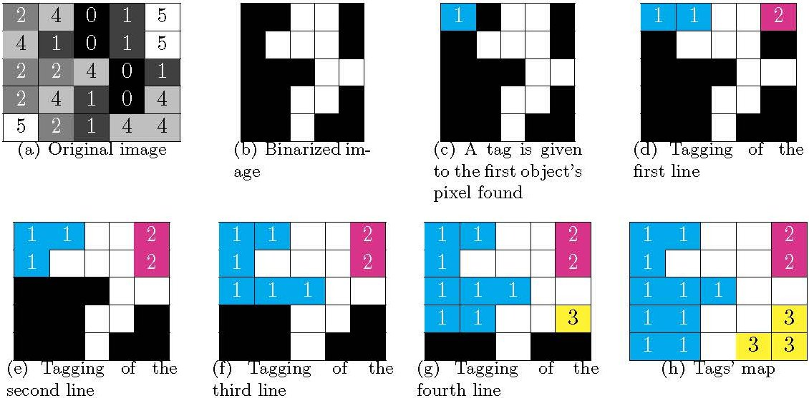
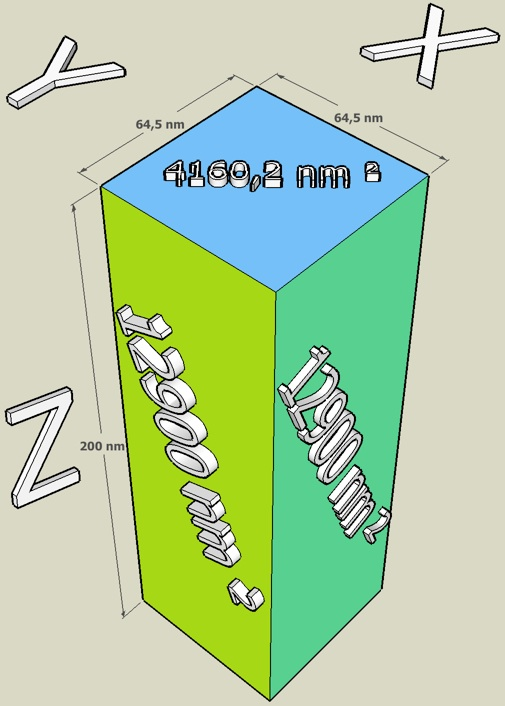
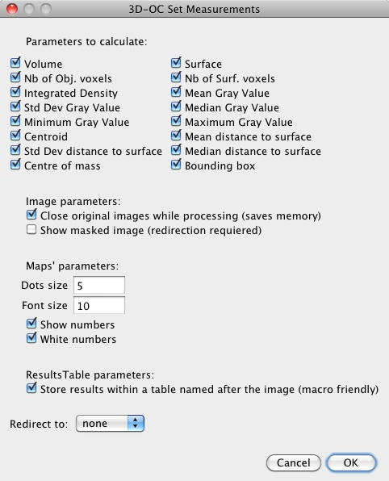
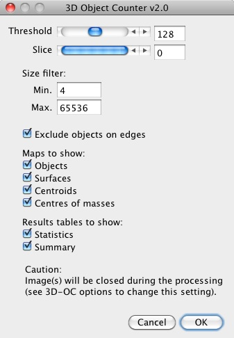
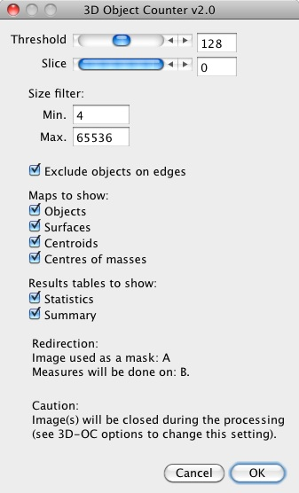

# 3D object counter plugin *a.k.a* 3D-OC

## How to install the plugin ?

1. Download and install the latest version of [ImageJ](http://rsbweb.nih.gov/ij/download.html).
2. Update ImageJ using the "Help/Update ImageJ" menu.
3. Download the latest version of [3D object counter](https://github.com/fabricecordelieres/IJ-Plugin_3D_object_counter/releases).
4. Drag and drop the plugin file on ImageJ's toolbar.
5. Using the "Save Dialog", save the file in the plugin folder.

A ***3D object counter*** entry should appear now under the ImageJ's plugins menu. It contains 2 entries:
* 3D Object Counter\...
* Set 3D Measurements\...

**To report any bug you may find while using this plugin, [please click here](mailto:fabrice.cordelieres@gmail.com?subject=Bug%20found%20in%203D-OC&body=%0ABug%20description:%0A%0AHow%20did%20it%20happen:%0A%0ACopy/Paste%20the%20content%20of%20the%20log%20window:%0A%0AVersion%20of%20ImageJ:%0A%0AVersion%20of%20Java:)**.

## What does it do ?

1. The user is first asked to set a threshold on the image. All pixels which intensity is above the threshold will be considered as object's pixels whilst other pixels will be considered as being part of the background.
2. Once Oked, the plugin starts a 2-passes connexity analysis:
* On the first pass, the stack will be scanned from its top left corner to its lower right corner. When the first object's pixel is found, the plugin gives it a tag. The tag is a unique number which will be carried by all pixels constitutive of the same object. The scan process goes on. Each time a new object's pixel is found, its 13 previous neighbors (9 on the upper slice and 4 on the same slice) are checked for an existing tag. The minimum tag found in the surrounding is then attributed to the current pixel. The following figure summarizes the connexity analysis process.

  

* On the second pass, ambiguities are resolved. For instance, when a U-shaped object is found, its two branches are tagged separately during the first pass as the two branches are only connected by their bottom parts. The same object is therefore considered as two. During the regulation process, two adjacent pixels carrying two different tags are detected, the higher tag being replaced on the full image by the lowest tag.
3. Statistics about each objects are then retrieved:
* ***Number of object's voxels***: determines the number of voxels (volume picture element) constitutive of the object.
* ***Volume***: number of voxels of the object * x calibration * y calibration * z calibration. If no calibration has been attributed to the image, returns the number of object's voxels.
* ***Number of surface voxels***: determines the number of voxels lacking at least one of its 26 neighbors (i.e. in contact with the background).
* ***Surface***: determines the surface of the object, taking into account the differences of dimensions between the xy, xz and yz sides of the surface voxels. The following figure presents an illustration of the differences of surfaces between the surfaces of the voxels, due to the disparity of dimensions along the x, y and z axes in optical microscopy. NB: The image should be spatially calibrated prior to analysis.
 

  

* ***Integrated density***: sum of the intensities of all the current object's voxels.
* ***Mean of the gray values***: average of the intensities of all the current object's voxels.
* ***Standard deviation of the gray values***: standard deviation of the intensities of all the current object's voxels.
* ***Minimum gray value***: minimum intensity found within the current object.
* ***Maximum gray value***: maximum intensity found within the current object.
* ***Median of the gray values***: median of the intensities of all the current object's voxels.
* ***Mean distance to surface***: average distance from the geometric centre of the current object to the surface's pixels.
* ***Standard deviation of the distance to surface***: standard deviation of distance from the geometric centre of the current object to the surface's pixels.
* ***Median distance to surface***: median distance from the geometric centre of the current object to the surface's pixels.
* ***Centroid***: tick this box to log the 3D coordinates of the geometrical centre for each object.
* ***Centre of mass***: tick this box to log the 3D coordinates of the centre of mass for each object (each set of coordinates constitutive of an object is pondered by its intensity).
* ***Bounding box***: smallest box encompassing the object: if this box is ticked, the coordinates of the upper left corner of the box, its width, height and depth are retrieved and logged.

## How to use it ?

### Setting the options

1. Prior to analysis, the parameters to calculate as well as some display parameters should be set. To do so, launch ***3D-OC Set Measurements***, which may be found in the "*Plugins/3D Object Counter/3D-OC Set Measurements\...*" menu. The following window appears:

  

The following options are available:
* ***Parameters to calculate***: tick the parameters that should be calculated for each found object (see [this section](#what-does-it-do-) for more details).
* ***Image parameters***:
  - *Close original images while processing (saves memory)*: when this option is ticked, the original image is closed at analysis startup.
  - *Show masked image (redirection required)*: if a redirection has been set (see below), ticking this box will enable the generation of a new image where only objects' pixels from the destination of redirection will be drawn. Background pixels will appear as black.
* ***Map's parameters***:
  - *Dots size*: size, in pixels, of the dots placed at the objects' centers.
  - *Font size*: size, in points, of the the object's labels, placed at the objects' centers.
  - *Show numbers*: tick this box to overlay the objects' numbers on the results images.
  - *White numbers*: tick this box to draw labels in white. If unticked, the labels will be drawn using the objects' tag value.
* ***ResultsTable parameters***:
  - *Store results within a table named after the image (macro friendly)*: the results are logged to a results table named "Results", unless this box is ticked: the table's name is then "Statistics for "+the image's title. This option makes it easier within a macro to select the corresponding results window for further processing.
* ***Redirect to***: this option allows to do the segmentation on the current image while intensity related measures will be calculated from the image chosen using the drop-down list.
2. Validate the choices by clicking on Ok: the options will be saved in the IJ_Prefs.txt file, to be used later during the analysis.

## Launching the analysis

1. Once options have been set, launch ***3D Object Counter***, which may be found in the "*Plugins/3D Object Counter/3D Object Counter\...*" menu. Depending on the options previously set, the window that appears might take one of the two forms depicted on the following figure:

  
  

* ***Threshold***: use this slider to define the limit intensity value separating the voxels in 2 populations: background voxels (intensities below the selected value) and objects' voxels.
* ***Slice***: when the plugin's interface is launched, this slider allows the user to navigate between slices.
* ***Size filter***: the two following fields will help to exclude from analysis objects which size is out of the defined range.
  - *Min.*: minimum size an object should have to get its statistics retrieved (expressed as a number of voxels).
  - *Max.*: maximum size an object should have to get its statistics retrieved (expressed as a number of voxels).
* ***Exclude objects on edges***: tick this box to exclude from analysis any object that touches at least one of the picture's edges.
* ***Maps to show***: allows to choose the kind of image outputs that should be generated. On those images, the intensity of all pixels constitutive of an object carry the same intensity: its tag. All statistics corresponding to this object will be presented on the results table on the n-th line, n being the value of the tag. Only object which sizes' fall into the size filter are displayed. If "Exclude on edges" is ticked, the objects touching one of stack's edges will be. discarded.
  - *Objects*: tick this box to create a stack where all retrieved objects are displayed.
  - *Surfaces*: tick this box to create a stack where all surface voxels (i.e. each voxel lacking at least one of its 26 neighbors) from all retrieved objects are displayed.
  - *Centroids*: tick this box to create a stack where all the geometrical centers from all retrieved objects are displayed.
  - *Centers of masses*: tick this box to create a stack where all the centers of masses from all retrieved objects are displayed.
* ***Results table to show***:
  - *Statistics*: when this box is ticked, a results table will display all statistics of the found objects. Its name will depend on the options set under the "3D-OC Set Measurements window" (see [this section](#setting-the-options) for more details).
  - *Summary*: if ticked, a summary will be sent to the "Log" window, containing the image's name, the number of objects found, the size filter parameters and the threshold used for analysis.
* ***"Redirection" section***: in case the redirection option is on, this section recalls the image used as a mask and the image used for intensities related measures.
* ***"Caution" section***: This section acts as a reminder as it only appears if the "Close original images while processing" option has been ticked within the "3D-OC Set Measurements window" (see [this section](#setting-the-options) for more details).
3. Validate the choices by clicking on Ok: the analysis starts, images are generated and results logged.

## How to cite the plugin ?

When using the "3D Object Counter" plugin for publication, please refer to [S. Bolte & F. P. Cordelières, A guided tour into subcellular colocalization analysis in light microscopy, Journal of Microscopy, Volume 224, Issue 3: 213-232.](https://onlinelibrary.wiley.com/doi/10.1111/j.1365-2818.2006.01706.x), to this [GitHub Repository](https://github.com/fabricecordelieres/IJ-Plugin_3D_object_counter/) and of course to ImageJ, as explained in the [FAQ section, on ImageJ's website](http://rsbweb.nih.gov/ij/docs/faqs.html). A copy of your paper being sent to [my e-mail address](mailto:fabrice.cordelieres@gmail.com) would also be greatly appreciated !
